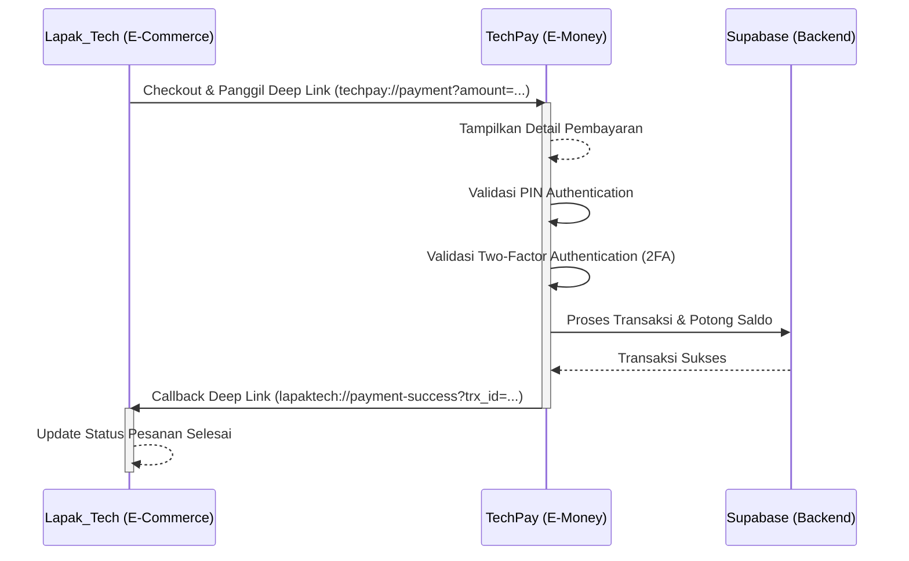
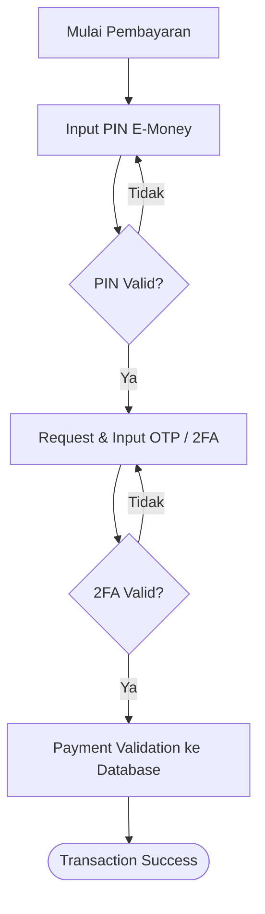

<div align="center">
  <!-- Banner Placeholder -->
  <!--  -->

  <h1>💸 TechPay</h1>
  <p><strong>Aplikasi E-Money berbasis Flutter Terintegrasi dengan Lapak_Tech</strong></p>
  
  <p>
    <a href="https://flutter.dev"></a>
    <a href="https://dart.dev"></a>
    <a href="https://firebase.google.com"></a>
  </p>
</div>

---

## 📖 Tentang Project

**TechPay** adalah aplikasi dompet digital (E-Money) yang dikembangkan sebagai bagian dari Tugas Akhir. TechPay dirancang secara khusus agar tidak berdiri sendiri, melainkan terintegrasi dengan aplikasi E-commerce **Lapak_Tech** sebagai metode pembayaran utama menggunakan mekanisme **Deep Link**.

Aplikasi ini menyediakan fitur e-money standar dengan keamanan berlapis melalui PIN dan *Two-Factor Authentication* (2FA) sebelum mengembalikan callback status pembayaran ke aplikasi E-commerce.

---

## 🎯 Tujuan Project

Project ini dibuat sebagai **implementasi integrasi dua aplikasi Flutter** yang berkomunikasi dua arah menggunakan Deep Link. Fokus utama dari sistem ini adalah menyediakan alur pembayaran yang mulus (*seamless*) antar aplikasi dengan menerapkan **keamanan berlapis** menggunakan autentikasi PIN dan 2FA (OTP).

---

## 🛠️ Tech Stack

Teknologi utama yang digunakan dalam pengembangan aplikasi TechPay:

| Kategori | Teknologi | Deskripsi |
| :--- | :--- | :--- |
| **Framework** | [Flutter](https://flutter.dev/) | Cross-platform mobile UI framework |
| **Bahasa** | [Dart](https://dart.dev/) | Bahasa pemrograman utama |
| **Backend & BaaS** | [FireBase](https://firebase.google.com/) | Autentikasi dan interaksi database |
| **Database** | MySQL | Relational database |
| **Routing** | Go Router | Navigasi deklaratif berbasis URL |
| **Storage** | Flutter Secure Storage | Penyimpanan lokal terenkripsi untuk Token/PIN |
| **Integration** | App Links / Deep Link | Komunikasi antar aplikasi Lapak_Tech & TechPay |
| **API** | REST API & JWT | Komunikasi client-server yang aman |
| **State Management**| *[Placeholder - e.g. Riverpod/Provider/Bloc]* | Manajemen state aplikasi |

*(Catatan: Beberapa tech stack dapat disesuaikan kembali sesuai implementasi final)*

---

## ✨ Fitur

- [x] Login
- [x] Register (Admin)
- [x] Dashboard
- [x] Saldo E-Money
- [x] Transfer Antar Pengguna
- [x] Pembayaran Merchant
- [x] Deep Link Payment Integration
- [x] PIN Authentication
- [x] Two-Factor Authentication (OTP/2FA)
- [x] Transaction History
- [x] User Profile
- [x] Logout

---

## 🏗️ Arsitektur Sistem

Berikut adalah diagram alur integrasi antara Lapak_Tech dan TechPay saat proses pembayaran terjadi:



---

## 💳 Flow Pembayaran

1. **Checkout di Lapak_Tech**: Pengguna menyelesaikan belanjaan di aplikasi Lapak_Tech dan memilih "TechPay" sebagai metode pembayaran.
2. **Redirect via Deep Link**: Lapak_Tech memanggil URI scheme dari TechPay yang berisi data transaksi (nominal, ID merchant, dll).
3. **Konfirmasi di TechPay**: Aplikasi TechPay terbuka dan menampilkan rincian pembayaran.
4. **Input PIN**: Pengguna memasukkan PIN TechPay untuk otorisasi awal.
5. **Verifikasi 2FA**: Pengguna memasukkan kode 2FA (OTP) untuk keamanan tambahan.
6. **Proses Transaksi**: TechPay memvalidasi saldo dan memproses transaksi ke database Supabase.
7. **Callback Success**: Setelah sukses, TechPay otomatis mengembalikan pengguna ke Lapak_Tech menggunakan callback URI dengan menyertakan status sukses dan ID transaksi.
8. **Pesanan Selesai**: Lapak_Tech memperbarui status pesanan menjadi Lunas.

---

## 📁 Struktur Folder

Project ini menggunakan struktur folder terorganisir yang memisahkan logic, UI, dan service.

```text
lib/
├── core/            # Konfigurasi dasar, theme, konstanta, dan error handling
├── models/          # Data class dan model serialisasi (JSON)
├── services/        # Logic API, Supabase, dan integrasi pihak ketiga (DeepLink)
├── screens/         # Tampilan halaman utama aplikasi (UI)
├── widgets/         # Komponen UI yang reusable (tombol, textfield, dll)
├── providers/       # State management logic
├── routes/          # Konfigurasi Go Router untuk navigasi dan deep link
├── utils/           # Fungsi helper dan utilitas pendukung
└── main.dart        # Entry point aplikasi Flutter
```

---

## 🔗 Deep Link Integration

TechPay dirancang untuk menerima request dari luar (Lapak_Tech) menggunakan sistem Deep Link / App Links.

* **Cara Kerja**: Aplikasi mendaftarkan custom URI scheme pada OS (Android/iOS). Saat URI tersebut dipanggil, OS akan otomatis membuka TechPay.
* **URI Scheme (Menerima Request)**: `techpay://payment`
* **Callback URL (Mengirim Response)**: `lapaktech://payment-result`

### Data Request (Dari Lapak_Tech ke TechPay)
```json
{
  "amount": "150000",
  "order_id": "ORD-12345",
  "merchant_name": "Lapak_Tech Store"
}
```
*Contoh URL: `techpay://payment?amount=150000&order_id=ORD-12345&merchant_name=Lapak_Tech+Store`*

### Data Response (Callback ke Lapak_Tech)
```json
{
  "status": "success",
  "transaction_id": "TRX-98765"
}
```
*Contoh Callback: `lapaktech://payment-result?status=success&transaction_id=TRX-98765`*

---

## 🔐 Two-Factor Authentication (2FA)

Untuk menjamin keamanan transaksi E-Money, flow otorisasi dibagi menjadi dua lapis:



---

## 📸 Screenshots

<table>
<tr>
<td align="center"><b>Login</b></td>
<td align="center"><b>Dashboard</b></td>
<td align="center"><b>Profil</b></td>
</tr>

<tr>
<td></td>
<td></td>
<td></td>
</tr>
</table>


---

## 🗺️ Roadmap

Fitur yang direncanakan untuk pengembangan ke depan:

- [ ] QRIS Payment Scanner
- [ ] NFC Payment (Tap to Pay)
- [ ] Push Notification Integrations
- [ ] Face ID / Biometrics Login
- [ ] Fingerprint Authentication
- [ ] Multi Merchant Integrations
- [ ] Dark Mode Support

---

## 👨‍💻 Author

**[Muhammad Vargas Cahyadhi]**
- Link YT: [https://youtu.be/lbAH9edAh3c]

